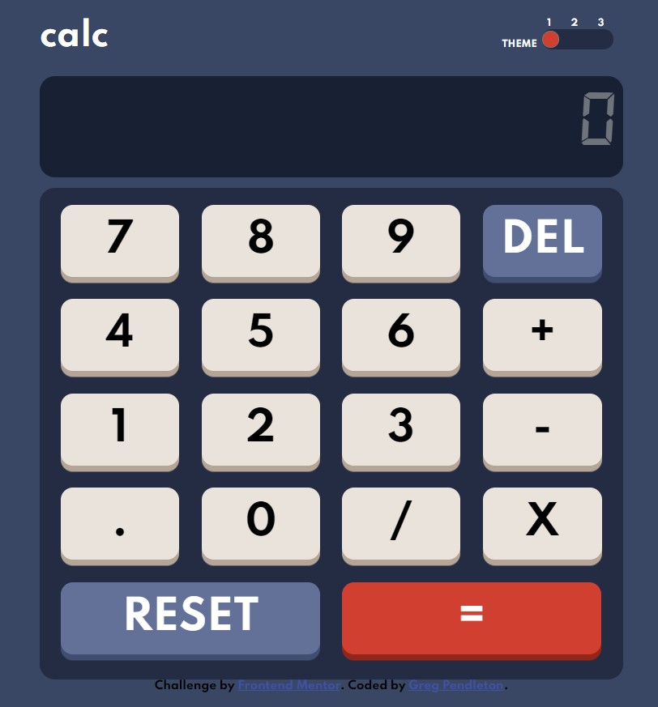

# Frontend Mentor - Calculator app solution

This is a solution to the [Calculator app challenge on Frontend Mentor](https://www.frontendmentor.io/challenges/calculator-app-9lteq5N29). Frontend Mentor challenges help you improve your coding skills by building realistic projects.

## Table of contents

- [Overview](#overview)
  - [The challenge](#the-challenge)
  - [Screenshot](#screenshot)
  - [Links](#links)
- [My process](#my-process)
  - [Built with](#built-with)
  - [What I learned](#what-i-learned)
  - [Continued development](#continued-development)
  - [Useful resources](#useful-resources)
- [Author](#author)

## Overview

### The challenge

Users should be able to:

- See the size of the elements adjust based on their device's screen size
- Perform mathematical operations like addition, subtraction, multiplication, and division
- Adjust the color theme based on their preference
- **Bonus**: Have their initial theme preference checked using `prefers-color-scheme` and have any additional changes saved in the browser

### Screenshot



### Links

- Solution URL: [GitHub page](https://github.com/gpend/calc-app)
- Live Site URL: [live site](https://gpend.github.io/calc-app/)

## My process

### Built with

- Semantic HTML5 markup
- CSS custom properties
- Flexbox
- Mobile-first workflow
- [jquery](https://jquery.com/) - JS library

### What I learned

- css variables
- css transitions and animation
- adding multiple listeners

### Code I'm proud of

```js
pushables.forEach(btn => {
    btn.addEventListener('click', (event) => {
        calculate( event.target.innerText );
   })
})
```

### Continued development

This was a fun challenge and a good introduction to some interesting concepts that I plan to work on and refine in the future.

- css animations
- draggable elements
- multiple themes

### Useful resources

- [Building a Magical 3D Button](https://www.joshwcomeau.com/animation/3d-button/) - This awesome tutorial helped me build the buttons.
- [16 segment font](https://www.dafont.com/16-segments.font) - This is a must have font for a calculator of this caliber.

## Author

- Greg Pendleton - [gpendleton.me](https://gpendleton.me)
- Frontend Mentor - [@gpend](https://www.frontendmentor.io/profile/gpend)
- Github - [gpend](https://github.com/gpend)
